# Stress_Detection
Deployed application: ~~https://odu-stress-app.herokuapp.com/~~ (Currently not deployed)

* Interactive way to visualize different sensor data, categorised by the task they were performing and the individual
* The bar charts contains the individuals response to various standard questionnaires (to establish ground truth)
* Sensor selected in image is Electrodermal activity
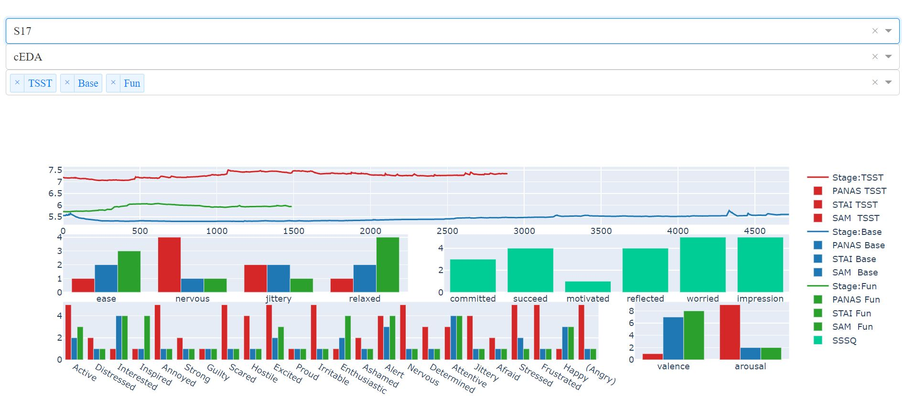

* Sensor selected in image is Acceleration in x direction
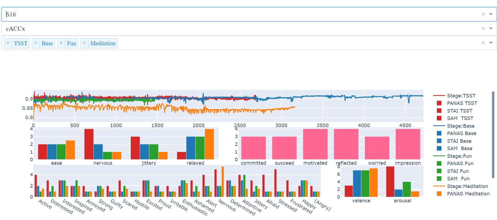

* Boxplot showing values from different sensors available
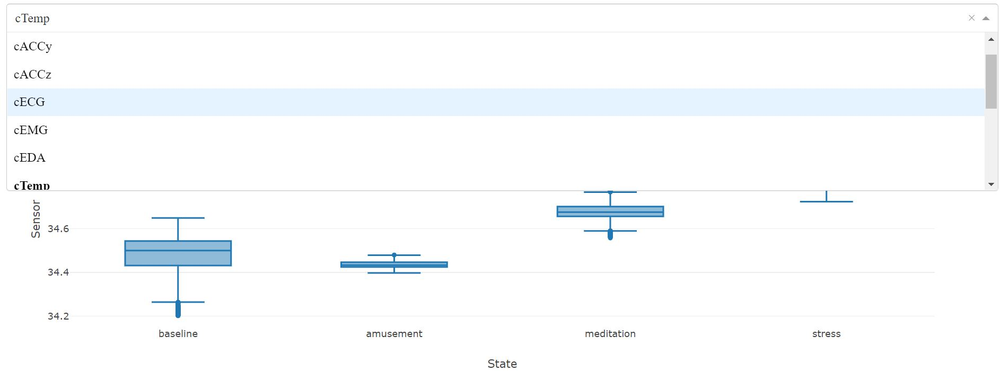

* Displaying live sensor data, to predict state of person in real time
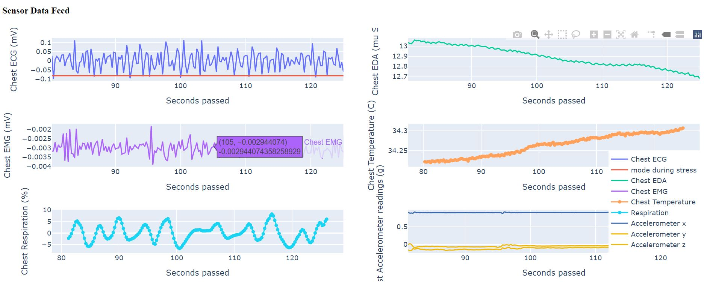
* The predictions for live sensor readings
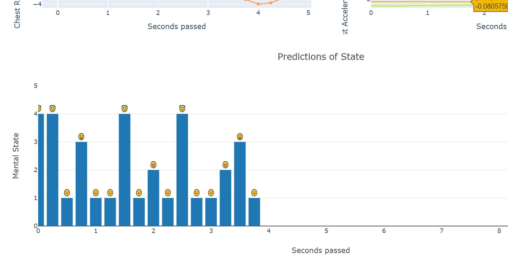

* Interactive modelling - upload dataset, select target, feature, and visualize modelling
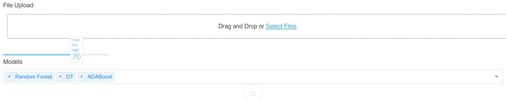
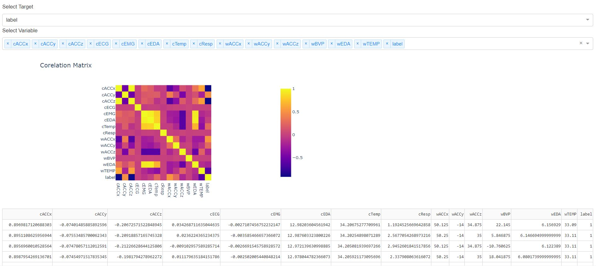
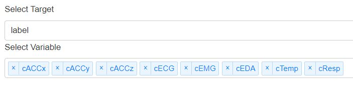
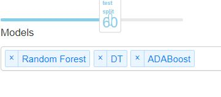
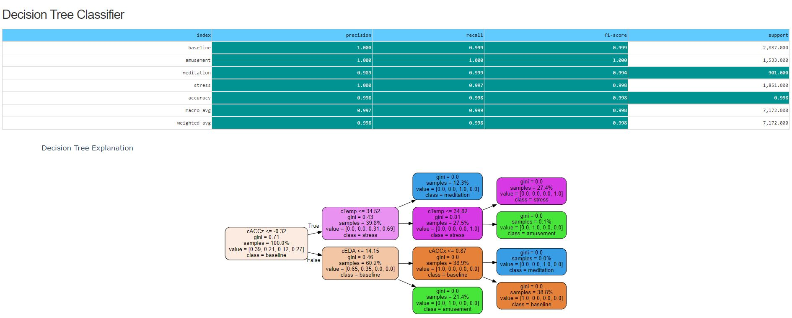
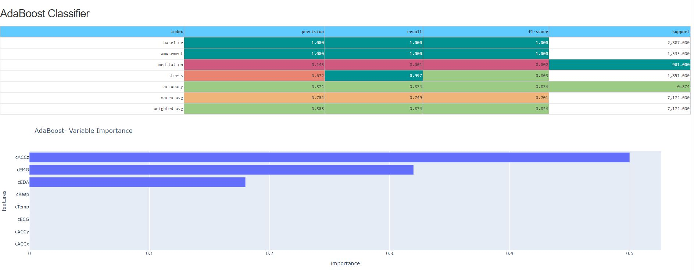

* Upload,process raw sensor data to SI units
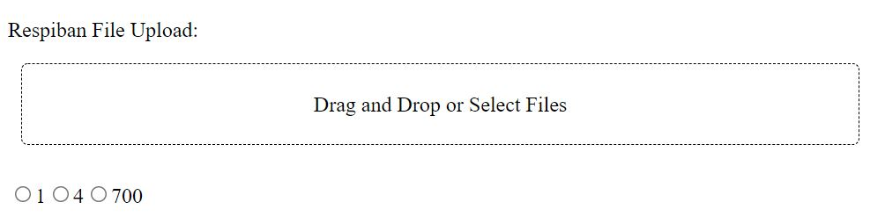
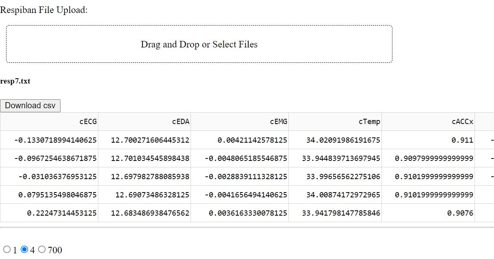

* Home page, to navigate
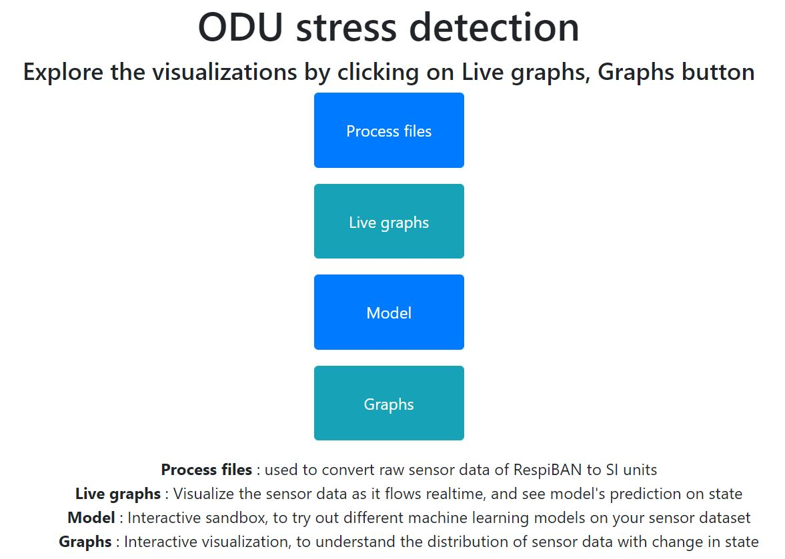

* Viewing group responses to questionnaires
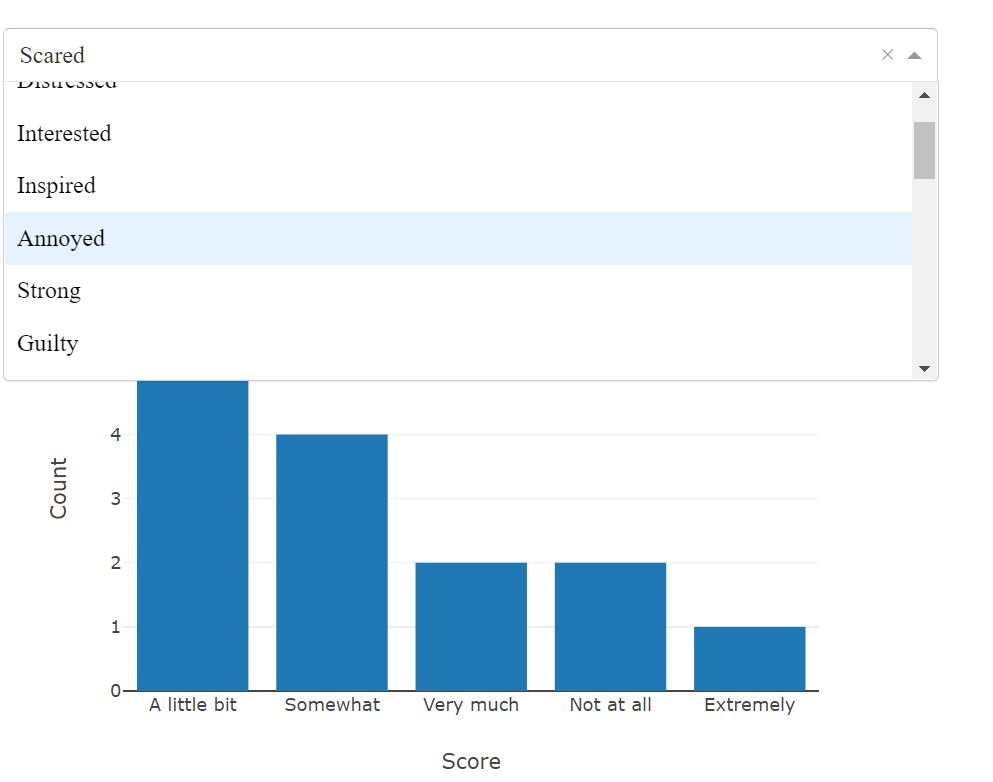

